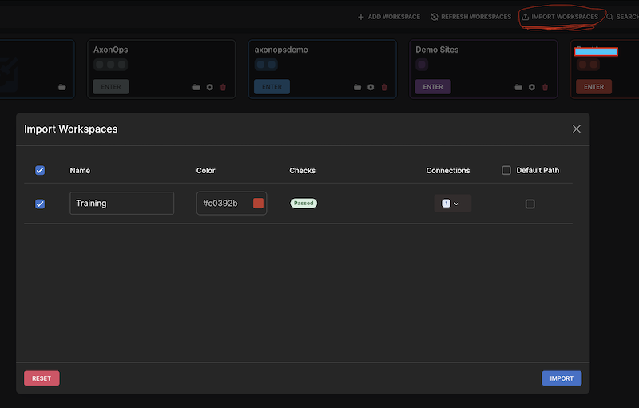

# AxonOps Workbench Connections

This directory contains connection configurations for [AxonOps Workbench](https://github.com/axonops/axonops-workbench), a desktop application for connecting to and querying Apache Cassandra clusters.

## What is AxonOps Workbench?

AxonOps Workbench is a purpose-built desktop application for Apache Cassandra that provides:

- Visual query interface for CQL
- Connection management with workspace support
- Query history and saved queries
- Schema browsing and exploration
- Cross-platform support (Windows, macOS, Linux)

## Using the Workspace

### Import the Workspace

1. **Download and Install AxonOps Workbench**
   - Visit [axonops.com/workbench](https://axonops.com/workbench) to download the desktop application
   - Or find the source on [GitHub](https://github.com/axonops/axonops-workbench)

2. **Import the Training Workspace**
   - Open AxonOps Workbench
   - Navigate to *Import Workspace* at the top right
   - Select the folder inside the `Training Workspace` directory or drag and drop it into _AxonOps Workspace_
   - The workspace will be imported with pre-configured connections to your provisioned Cassandra cluster

3. **Enter Credentials**
   - **Important:** Username and password are not stored in this workspace configuration for security reasons
   - When you import the connection, you will need to enter the Cassandra credentials provided to you

4. **Connect to the Cluster**
   - After entering credentials, you can connect and start querying your Cassandra cluster

## Workspace Contents

The `Training Workspace` directory contains pre-configured connection settings for the Cassandra cluster provisioned by this lab environment, including:

- Node IP addresses and ports
- Authentication settings
- SSL/TLS configuration (if enabled)
- Datacenter information

**Note:** Credentials are intentionally excluded from the workspace files for security purposes and must be entered manually when importing.

## Keeping Connections Up to Date

The connection configurations in this workspace are safe to commit to Git. When the cluster infrastructure changes (e.g., node IPs are reassigned), update the workspace configuration and commit the changes so all team members can import the updated workspace.

## Learn More

- [AxonOps Workbench Documentation](https://axonops.com/docs/workbench/)
- [Download AxonOps Workbench](https://axonops.com/workbench)
- [GitHub Repository](https://github.com/axonops/axonops-workbench)
